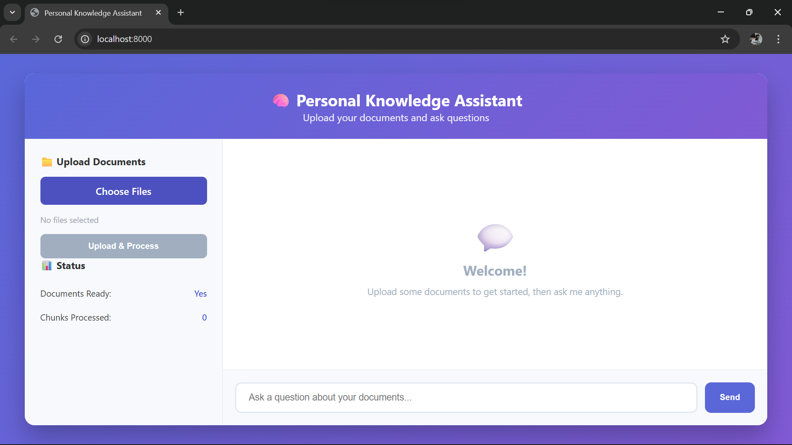

# RAG-Based Knowledge Assistant

A simple RAG (Retrieval-Augmented Generation) chatbot that allows you to **upload documents, process them, and ask questions** using AI.  
Built with **FastAPI**, **ChromaDB**, **Sentence-Transformers**, and a **HTML/CSS/JS frontend**.

---

## Screenshot
> Add your screenshot at: `screenshots/app.png`



---

## Features
- Upload PDF/TXT documents  
- Automatic text extraction & chunking  
- Embedding generation using Sentence-Transformers  
- Fast semantic search via ChromaDB  
- Ask questions and get AI-generated answers  
- Lightweight frontend using HTML, CSS, JavaScript  

---

## Installation

### 1️⃣ Clone the Repo
```bash
git clone https://github.com/Dosscyril/RAG-Based-Knowledge-chatbot.git
cd RAG-Based-Knowledge-chatbot
